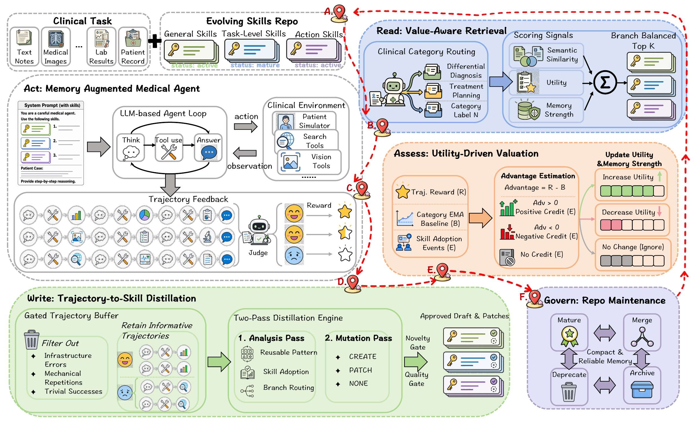

<div align="center">
  
  <h1>SkeMex</h1>
  <h3>Experience Makes Skillful</h3>
  <p><b>Enabling Generalizable Medical Agent Reasoning<br>via Self-Evolving Skill Memory</b></p>
  <p>
    <a href="https://arxiv.org/abs/2606.09365v3"></a>
    
    
    <a href="LICENSE"></a>
    
  </p>
  <p>
    🌐 <a href="https://manglu097.github.io/SkeMex/">Project site</a> ·
    📄 <a href="https://arxiv.org/abs/2606.09365v3">Paper</a> ·
    🚀 <a href="#-quick-start">Quick start</a> ·
    🗂️ <a href="data/README.md">Data</a> ·
    🔧 <a href="configs/README.md">Tools</a> ·
    🧩 <a href="examples/skill_demo/README.md">Skill demos</a> ·
    🧪 <a href="scripts/README.md">Experiments</a> ·
  </p>
</div>

---

**SkeMex lets medical agents improve through experience, while keeping model weights fixed.** It turns informative trajectories into reusable skills, retrieves them using relevance and learned utility, and maintains the repository through a **Read → Write → Assess → Govern** lifecycle.

<p align="center"></p>

## ✨ What is inside?

| | Component | Purpose |
|---|---|---|
| 📚 | Three skill branches | General reasoning, task-specific procedures, and action/tool knowledge |
| 🔎 | Value-aware retrieval | Combine semantic similarity, utility, and temporal memory strength |
| ✍️ | Trajectory-to-skill writing | Analyze experience, create or patch skills, review novelty and quality |
| 📈 | Utility estimation | Attribute outcome-based credit relative to clinical category baselines |
| 🌱 | Repository governance | Merge, promote, deprecate, and enforce capacity limits |
| 🧪 | Experiment tooling | Offline/online evolution, ID/OOD evaluation, and resume support |

The repository provides the implementation, prompts, and portable configurations. The [data directory](data/README.md) provides official source links, preparation recipes, and split metadata. The [skill gallery](examples/skill_demo/README.md) shows 15 evolved examples across the three branches. Benchmark records, run logs, and trained checkpoints are not bundled. The public paper link currently points to [arXiv v3](https://arxiv.org/abs/2606.09365v3). The default configurations follow the paper's window, buffer, model, and context settings.

## 🧩 What does an evolved skill look like?

Browse [15 selected skill examples](examples/skill_demo/README.md), with five from each branch:

| 🧠 General | 🩺 Task-level | 🛠️ Action-level |
|---|---|---|
| Reusable reasoning principles | Clinical task procedures | Tool-specific practices |
| Missing inputs, evidence checks, output constraints | Diagnosis, guidelines, medication safety, imaging, prevention | Retrieval, source verification, result validation |

The examples preserve learned skill text and illustrate its structure; they are a display collection rather than an evaluation checkpoint.

## 🚀 Quick start

### 1. Install from this checkout

Python **3.10+**, Linux or macOS. Run commands from the repository root. The experiment scripts and evaluators use the source checkout; an editable installation is the supported workflow.

```bash
python -m venv .venv
source .venv/bin/activate
python -m pip install -e .
python scripts/smoke_test.py
```

The smoke test uses a synthetic task and a mock model: **no API key, dataset, GPU, or network access required**.

### 2. Configure services 🔑

```bash
cp .env.example .env
# Edit .env with your service URLs, credentials, and local data paths.
set -a
source .env
set +a
```

| Service | Configuration |
|---|---|
| Agent & memory evolution | `OPENAI_BASE_URL`, `OPENAI_API_KEY`; DeepSeek-V3.2 in the default configs |
| Rubric & semantic judge | `JUDGE_BASE_URL`, `JUDGE_API_KEY`; Gemini-3-Flash model alias in `configs/eval/default.json` |
| Skill embeddings | `EMBEDDING_BASE_URL`, `EMBEDDING_API_KEY`; `text-embedding-3-large` |
| Medical image analysis | `VISION_BASE_URL`, `VISION_API_KEY`; Hulu-Med-32B |
| Search & knowledge tools | Tavily/UMLS/NCBI/Semantic Scholar keys and local MedRAG/DrugBank paths as applicable |

Use API roots ending in `/v1`. Model aliases must match the models served by your provider. Configuration files contain environment placeholders; `.env` is ignored by Git. See [service configuration](configs/CONFIGURATION.md) and the [tool setup guide](configs/README.md) for every tool’s credentials, resources, and official links.

### 3. Prepare benchmarks 🗂️

Arrange the processed splits under `data/train/` and `data/test/`, following [the data guide](data/README.md). Set `SKEMEX_DATA_ROOT` to the root containing the original image directories. The paper uses **1,254 training examples and 2,024 test examples**, with five benchmark configurations reserved entirely for OOD evaluation.

```bash
python scripts/verify_paper.py --train-root data/train --test-root data/test
```

### 4. Evolve and evaluate 🧠

```bash
# Offline: accumulate skills on the seven ID training splits, then evaluate.
python scripts/run_offline_evolution.py \
  --run_mode train_then_eval \
  --train_root data/train --test_root data/test \
  --experiment_root skills/offline --output_dir output/offline

# OOD: evaluate the same skill repository on unseen benchmark families.
python scripts/run_offline_evolution.py \
  --run_mode eval_only --test_root data/test \
  --experiment_root skills/offline --output_dir output/ood \
  --eval_benches AgentClinic_Text AgentClinic_MM MediQ MMMU_Pro MedJourney

# Online: three rounds, matching the camera-ready epoch@1–3 setting.
python scripts/run_online_evolution.py \
  --data_root data/test --benches AgentClinic_Text \
  --experiment_root skills/online_agentclinic_text --output_dir output/online_agentclinic_text
```

Use a fresh experiment directory for each independent run. Online stream scores and post-epoch evaluation scores have different meanings; [the experiment guide](scripts/README.md) explains how to distinguish them.

## 🧭 Repository map

```text
SkeMex/
├── assets/                  # Paper architecture figure and logo
├── configs/                 # Model, tool, and evolution settings + setup guide
├── data/                    # Source links, preparation recipes, verified splits
├── docs/                    # Interactive GitHub Pages site
├── eval/                    # Choice, semantic, and rubric evaluators
├── examples/skill_demo/      # 5 selected examples per skill branch
├── scripts/                 # Experiment entry points and usage guide
├── src/medmem_agent/
│   ├── agent.py             # Bounded ReAct interaction loop
│   ├── evolution/           # Read / Write / Assess / Govern
│   ├── evolution_assets/    # Initial categories and context-management templates
│   └── tools/               # Retrieval, clinical tools, vision, and simulation
```

## 🔬 Paper settings

| Setting | Value |
|---|---|
| Agent steps / retrieved skills | 7 / 6 |
| Online rounds | 3 (camera-ready Table 3) |
| Retrieval weights: similarity / utility / memory | 0.4 / 0.4 / 0.2 |
| Learning window / retained buffer | 30 / 20 trajectories |
| Governance interval | Every 2 windows |
| Context budget | 16,384 tokens |
| General / task / action capacity | 12 / 8 per category / 5 per tool |

These values are encoded in the default configuration files. Benchmark scores require the processed data, model/service versions, and run provenance.

Keep clinical records, credentials, and generated traces out of public distributions. Third-party datasets, model weights, corpora, and services retain their own licenses and access terms.

## 📖 Citation

```bibtex
@article{sun2026experience,
  title={Experience Makes Skillful: Enabling Generalizable Medical Agent Reasoning via Self-Evolving Skill Memory},
  author={Sun, Haoran and Li, Wenjie and Zhang, Yujie and Lin, Zekai and Zhang, Fanrui and Chen, Kaitao and He, Xingqi and Li, Yichen and Liu, Mianxin and Liu, Lei and others},
  journal={arXiv preprint arXiv:2606.09365},
  year={2026}
}
```

## 🤝 Acknowledgments & license

We thank the benchmark, model, and memory-agent communities on which this research builds. Dataset project links are collected in [the data guide](data/README.md).

The source code is released under the [MIT License](LICENSE). Third-party data, model weights, corpora, and services retain their own terms. This research implementation is intended for benchmark experimentation.
